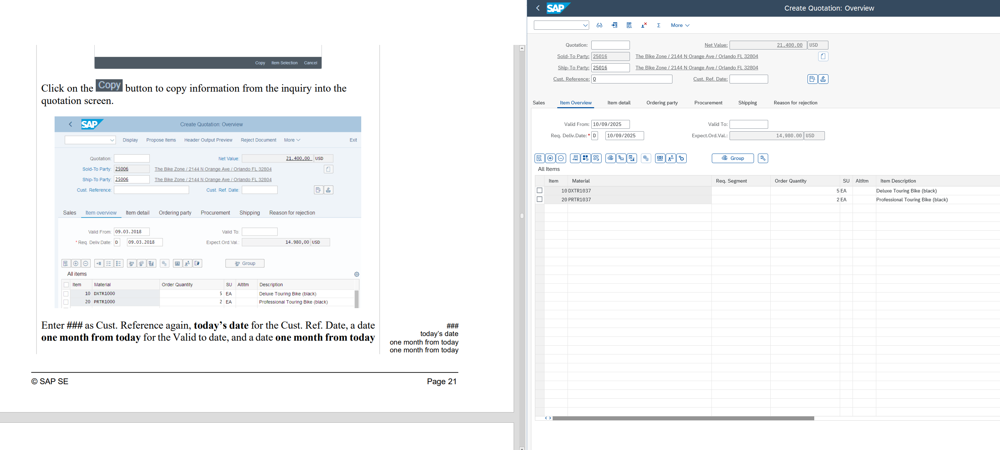
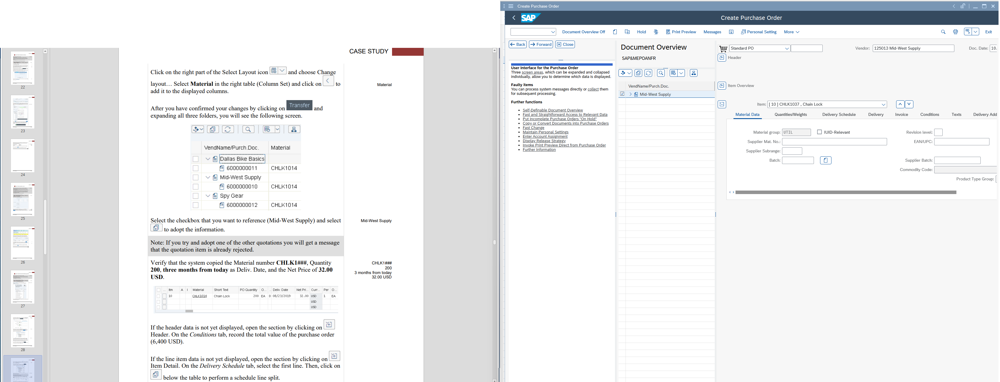
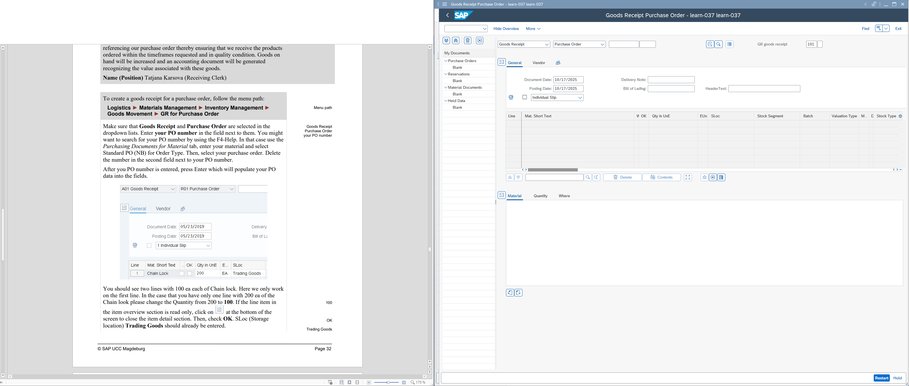
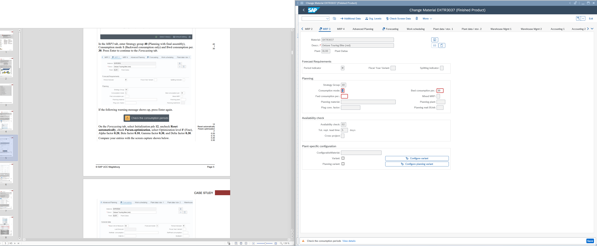

# 🏢 SAP-S4HANA-Labs

Hands-on **SAP S/4HANA** lab portfolio covering end-to-end ERP workflows using the **Global Bike (GBI)** dataset.  
This repository documents practical execution across **SD / MM / PP / FI / CO** modules with lab summaries and selected screenshots.

---

## 🎯 Project Goal

This project is designed to document hands-on SAP S/4HANA practice through structured lab execution and supporting evidence.

What this repo demonstrates:
- Hands-on execution of key SAP S/4HANA transactions (**not theory-only**)
- Understanding of ERP process flow across multiple modules (**cross-module integration**)
- Validation of business process impact through screenshots and lab summaries (**evidence-based learning**)

---

## 🧠 Key Transactions Covered (T-Codes)

Below are selected transactions used across labs to validate end-to-end process execution.

- **SD (Sales & Distribution)**: VA21, VA01, VL01N, VF01  
- **MM (Materials Management)**: ME21N, ME49, MIGO  
- **PP (Production Planning)**: MM02, CO01  
- **FI (Financial Accounting)**: FS10N, F-53, FBL1N  
- **CO (Controlling)**: Cost Element / Cost Flow validation (lab-based)

> Note: The exact transactions may vary depending on the lab environment and case scenario.

---

## 🧩 Lab Summaries

All lab documents are available in the `labsummary/` folder.

| Lab | Topic | Modules | Key Learning Outcome |
|---|---|---|---|
| [Lab 1](https://github.com/hyuntaepark-gh/SAP-S4HANA-Labs/blob/main/labsummary/Lab%201_Order_to_cash.pdf) | Order-to-Cash (O2C) | SD → FI | Executed the sales lifecycle from sales order to delivery and billing (FI impact) |
| [Lab 2](https://github.com/hyuntaepark-gh/SAP-S4HANA-Labs/blob/main/labsummary/Lab_2_Materials_Management.pdf) | Materials Management | MM | Practiced the procurement lifecycle (PO → Goods Receipt → inventory updates) |
| [Lab 3](https://github.com/hyuntaepark-gh/SAP-S4HANA-Labs/blob/main/labsummary/Lab_3_Production_Planning.pdf) | Production Planning | PP | Worked with BOM/routing and production order execution flow |
| [Lab 4](https://github.com/hyuntaepark-gh/SAP-S4HANA-Labs/blob/main/labsummary/Lab_4_Controlling.pdf) | Controlling | CO | Explored cost elements and basic cost flow / controlling concepts |
| [Lab 5](https://github.com/hyuntaepark-gh/SAP-S4HANA-Labs/blob/main/labsummary/Lab_5_Integrated_Process.pdf) | Integrated Process | SD + MM + FI + CO | Validated end-to-end integration and data flow across modules |

---

## 📚 Case Study

The case study document is available in the [`case-study/`](./case-study) folder.

- [`ERP_MRP_Case_Study_Dupry_Beauty.pdf`](./case-study/ERP_MRP_Case_Study_Dupry_Beauty.pdf)  
  A structured case study focused on **MRP planning logic** and ERP process reasoning.  
  This section demonstrates the ability to explain **why** ERP outcomes happen, not only how to execute transactions.

---

## 🖼️ Selected Screenshot Highlights

These screenshots provide evidence of hands-on execution in SAP S/4HANA across major modules.

### SD — Quotation & Pricing
  


### MM — Purchase Order & Goods Receipt
  


### PP — Material Master (MRP View)


### FI — GL Account Balance Validation


---

## 🧾 Screenshot Naming Convention (Recommended)

To keep this repository consistent and easy to navigate, screenshots follow this naming pattern:

`XX_MODULE_TCODE_ScreenName_Action.png`

Examples:
- `01_SD_VA21_Quotation_Overview.png`
- `02_MM_ME21N_CreatePurchaseOrder_DocumentOverview.png`
- `07_FI_F53_PostOutgoingPayment_HeaderData.png`

---

## 🛠 Tools & Environment

- SAP S/4HANA (Lab environment)
- SAP GUI (Windows)
- Global Bike (GBI) dataset
- ERP modules: SD, MM, PP, FI, CO

---

## 📌 Notes

- This repository is intended for **learning and portfolio demonstration** purposes.
- Lab PDFs and materials belong to their respective owners/instructor.
- Screenshots may include masked values for privacy/security.

---

## 📁 Repository Structure

```text
SAP-S4HANA-Labs/
├── labsummary/          # Lab PDF summaries (O2C, MM, PP, CO, Integration)
├── case-study/          # Case study PDF
├── screenshot/          # Selected screenshots from SAP execution (evidence of hands-on practice)
└── README.md
