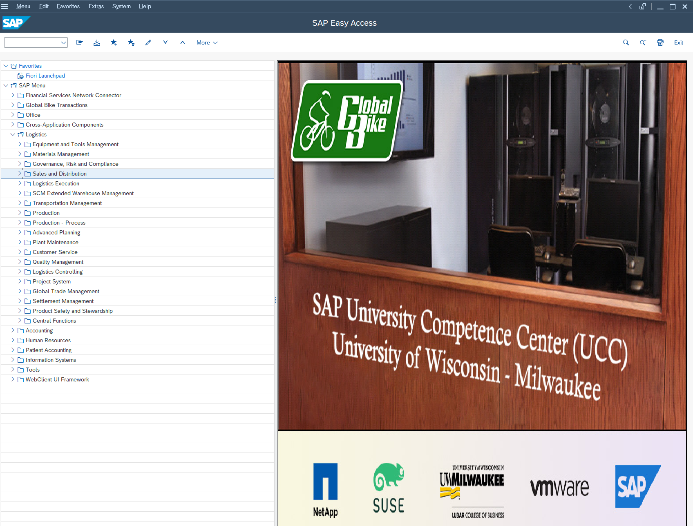
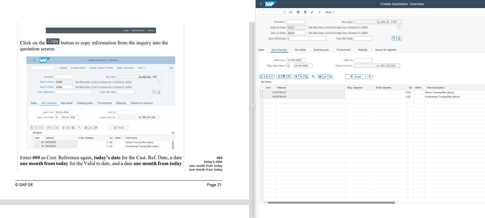
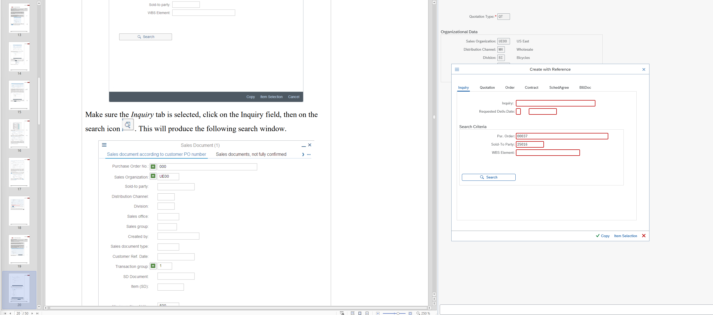
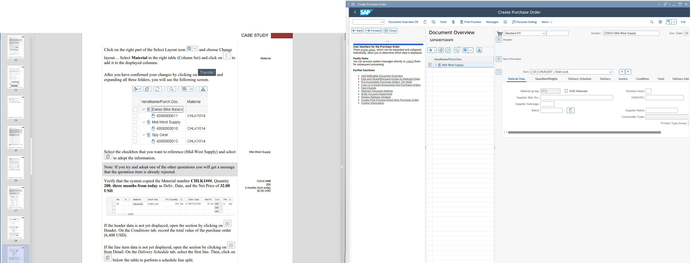
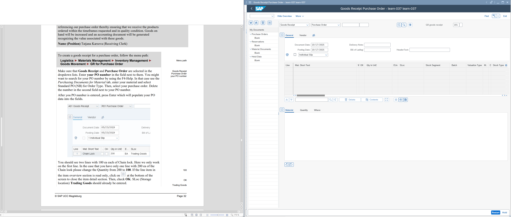
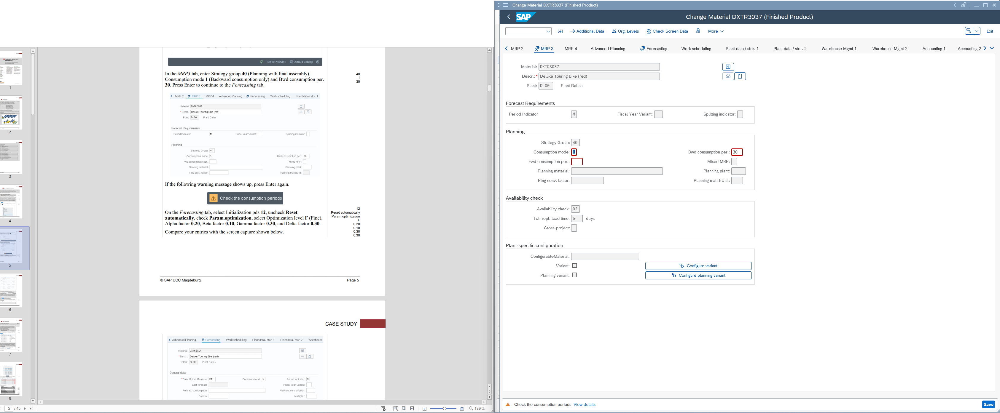
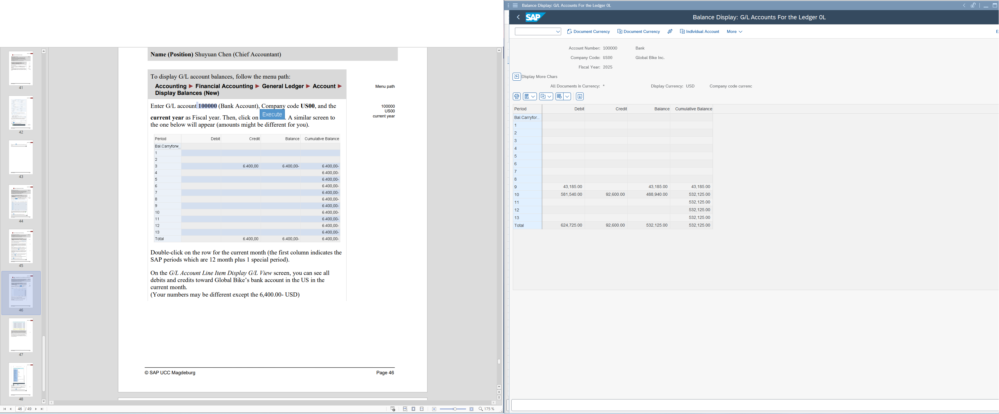
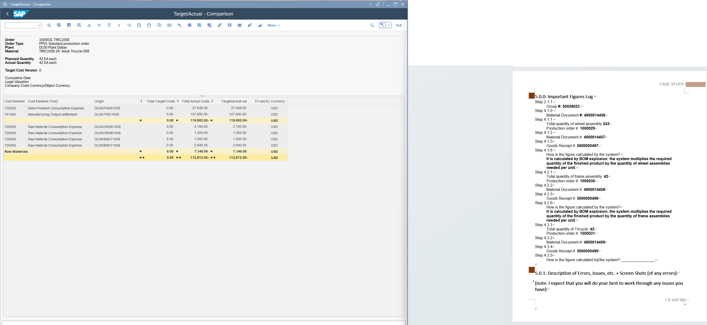

# 🏢 SAP-S4HANA-Labs


Hands-on **SAP S/4HANA** lab portfolio covering end-to-end ERP workflows using the **Global Bike (GBI)** dataset.  
This repository documents practical execution across **SD / MM / PP / FI / CO** modules with lab summaries and supporting screenshots.

---

# 🎯 Project Goal

This project documents **hands-on SAP S/4HANA practice** through structured lab execution and supporting evidence.

What this repository demonstrates:

- Practical execution of key SAP S/4HANA transactions (**not theory-only**)
- Understanding of **ERP process flow across multiple modules**
- Evidence-based validation of business processes through **system screenshots**
- Exposure to **cross-module integration (SD → MM → FI → CO)**

---

# 🧠 Key Transactions Covered (T-Codes)

Below are selected transactions used across labs to validate end-to-end process execution.

### SD — Sales & Distribution
- VA21 — Create Sales Quotation
- VA01 — Create Sales Order
- VL01N — Create Delivery
- VF01 — Billing Document

### MM — Materials Management
- ME21N — Create Purchase Order
- ME49 — Price Comparison
- MIGO — Goods Receipt

### PP — Production Planning
- MM02 — Change Material Master (MRP View)
- CO01 — Create Production Order

### FI — Financial Accounting
- FS10N — G/L Account Balance Display
- F-53 — Post Outgoing Payment
- FBL1N — Vendor Line Item Display

### CO — Controlling
- Cost element flow validation
- Cross-module cost impact verification

> Note: The exact transactions may vary depending on the lab environment and case scenario.

---

# 🧩 Lab Summaries

All lab documents are available in the `labsummary/` folder.

| Lab | Topic | Modules | Key Learning Outcome |
|---|---|---|---|
| Lab 1 | Order-to-Cash (O2C) | SD → FI | Executed the sales lifecycle from sales order to delivery and billing |
| Lab 2 | Materials Management | MM | Practiced procurement lifecycle (PO → Goods Receipt → inventory updates) |
| Lab 3 | Production Planning | PP | Worked with BOM, routing, and production order flow |
| Lab 4 | Controlling | CO | Explored cost elements and internal cost flow |
| Lab 5 | Integrated ERP Process | SD + MM + FI + CO | Validated cross-module integration across ERP workflow |

Lab documents are available in the **labsummary** folder.

---

# 📚 Case Study

The case study document is available in the `case-study/` folder.

ERP MRP Case Study — Dupry Beauty

This case study focuses on:

- MRP planning logic
- ERP decision reasoning
- Supply-demand planning logic

It demonstrates the ability to explain **why ERP outcomes occur**, not only how to execute transactions.

---

# 🖼️ Selected Screenshot Highlights

### SAP System Environment



These screenshots provide evidence of hands-on execution in SAP S/4HANA across major modules.

### SD — Quotation & Pricing





---

### MM — Purchase Order & Goods Receipt





---

### PP — Material Master (MRP View)



---

### FI — GL Account Balance Validation



---

# 🔄 ERP Process Flow (Example)

The labs demonstrate how transactions across different SAP modules are connected through an integrated ERP workflow.

Example **Order-to-Cash process flow**:

```
Customer Inquiry
        │
        ▼
Sales Quotation (VA21)
        │
        ▼
Sales Order (VA01)
        │
        ▼
Delivery Creation (VL01N)
        │
        ▼
Goods Issue / Inventory Update
        │
        ▼
Billing Document (VF01)
        │
        ▼
Financial Accounting Posting (FI)
```

This illustrates how **Sales (SD), Materials Management (MM), and Financial Accounting (FI)** interact within an integrated ERP environment.

---

# 🔗 Cross-Module Integration

Typical ERP workflows span multiple modules rather than a single transaction.

Example integration demonstrated in these labs:

| Process Step | SAP Module | Example Transaction |
|---|---|---|
| Sales quotation | SD | VA21 |
| Sales order creation | SD | VA01 |
| Delivery processing | SD / MM | VL01N |
| Goods movement | MM | MIGO |
| Billing | SD | VF01 |
| Accounting validation | FI | FS10N / FBL1N |

This cross-module interaction highlights how **ERP systems synchronize operational activities with financial outcomes.**

---

# 💡 Key Takeaways from SAP Labs

Through these SAP S/4HANA labs, several important ERP concepts became clear:

- ERP systems are **process-driven**, not just collections of individual modules.
- Operational transactions (sales, procurement, production) are tightly linked to **financial accounting impacts**.
- **Document flow** enables traceability across business processes.
- Cross-module integration (SD → MM → FI → CO) ensures operational and financial consistency.

---

# 🧾 Screenshot Naming Convention

Screenshots follow the naming pattern below:

```
XX_MODULE_TCODE_ScreenName_Action.png
```

Examples from this repository:

### SD — Sales Quotation


---

### MM — Purchase Order


---

### PP — Production Planning


---

### FI — Financial Accounting




This naming convention ensures screenshots are organized by:

- SAP Module
- Transaction Code
- Screen Context
- Process Step

---

# 🛠 Tools & Environment

- SAP S/4HANA (Lab Environment)
- SAP GUI (Windows)
- Global Bike (GBI) Dataset
- ERP Modules: SD, MM, PP, FI, CO

---

# 📌 Notes

- This repository is intended for **learning and portfolio demonstration purposes**.
- Lab materials belong to their respective instructors or institutions.
- Some screenshots may contain masked data for privacy.

---

# 📁 Repository Structure

```
SAP-S4HANA-Labs/
│
├── labsummary/      # Lab PDF summaries
├── case-study/      # ERP case study
├── screenshot/      # SAP execution screenshots
└── README.md
```
